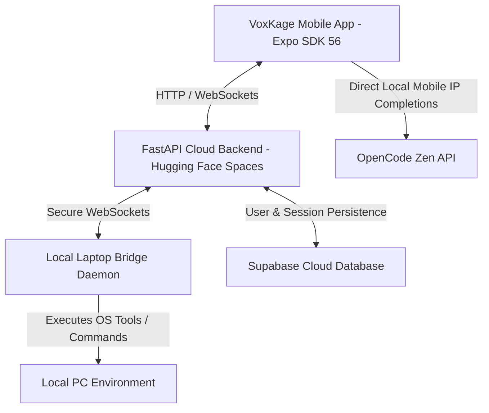

# VoxKage Mobile

<p align="center">
  
</p>

<p align="center">
  <a href="https://expo.dev"></a>
  <a href="https://reactnative.dev"></a>
  <a href="https://fastapi.tiangolo.com"></a>
  <a href="https://supabase.com"></a>
  <a href="https://www.docker.com"></a>
  <a href="LICENSE"></a>
</p>

VoxKage Mobile is an agentic-first AI workspace application designed to act as your personalized system-level companion. Operating through a clean mobile client interface, it serves as a command center that seamlessly delegates, schedules, and executes multi-agent tasks, workflows, and system commands directly in your local environment.

---

## 🏗️ Core Architecture

VoxKage Mobile operates through a three-tier system:



### 1. Cloud Orchestration Layer (Hugging Face Spaces)
The backend FastAPI application runs inside a Docker container on Hugging Face Spaces. It contains:
- The **Swarm Manager**: Coordinates parallel agent networks for developer workflows.
- The **Cognitive Agent Loop**: Manages deep history tracking, semantic compaction, and local RAG document parsers.
- **State Integration**: Relies on Supabase for credentials storage, chat histories, active sessions, and sandbox files.

### 2. Local Laptop Bridge Daemon
A lightweight client running locally on your computer. When the backend agent triggers an OS-level capability (such as executing shell commands, retrieving local files, running local web crawlers, or compiling code), the request is forwarded via secure WebSocket channels to the local bridge client, which executes it locally and feeds back the terminal output.

### 3. Local Mobile IP Routing (OpenCode Zen completions)
To bypass cloud-level API rate-limiting or network blockages (such as Jio/Airtel SNI connection resets), when compiled to a standalone APK, VoxKage Mobile routes OpenCode Zen API completions directly from the mobile device's local network connection to `https://opencode.ai/zen/v1`, keeping traffic clean and fast.

### 4. Heartbeat Keep-Alive Workflow
A recurring GitHub action that automatically pings the FastAPI backend health endpoint every 10 minutes, preventing the Hugging Face Space from entering sleep mode due to inactivity.

---

## ⚡ What Makes VoxKage Mobile Different?

- **Multi-Agent Swarms (`/agents`)**: Spin up parallel workflows and let specialized agents coordinate requirements scoping, planning, implementation, and code verification.
- **Interactive Playgrounds**: Live React/HTML sandbox previewing directly inside the mobile app to quickly test frontend and styling changes.
- **Adaptive SOUL Memory**: Personalized profile matching that learns coding habits, directories, and preferences over time.
- **Interactive Scoping (`/drill`)**: Starts structured requirements interview cycles to align on engineering tasks before building.
- **Stateless Queries (`/btw`)**: Launch side-channel questions without polluting the active conversation history or context window.
- **Context Compaction (`/compact`)**: Compresses past conversation logs automatically using semantic summarization to optimize LLM input tokens.

---

<p align="center">
  
</p>

---

## 🔑 Prerequisites & Configuration

To set up your own independent instance of VoxKage Mobile, you must configure three external dependencies:

### 1. Hugging Face Space Setup (Docker Host)
1. Go to [Hugging Face Spaces](https://huggingface.co/spaces) and click **Create new Space**.
2. Set your Space name, select **Docker** as the SDK, and choose **Blank** as the template.
3. In your Space's Settings, configure the following secrets under **Variables and secrets**:
   - `SUPABASE_URL`: Your Supabase API endpoint.
   - `SUPABASE_KEY`: Your Supabase anon or service role key.
   - `OPENCODE_API_KEY`: Your OpenCode Zen API key.
   - `JWT_SECRET_KEY`: A secure random string to sign JWT tokens.
   - `VOXKAGE_MASTER_KEY`: A secure master passphrase used to authenticate master-login/registration.
   - `GROQ_API_KEY` *(Optional)*: Groq key for faster secondary agent actions.
   - `SMTP_SERVER` / `SMTP_PORT` / `SENDER_EMAIL` / `SENDER_PASSWORD` *(Optional)*: For sending registration OTPs.

### 2. Supabase Database Instance
Create a new Supabase project and execute the SQL below in the SQL Editor to set up the schema:

```sql
-- Chat Sessions Table
CREATE TABLE sessions (
  id UUID PRIMARY KEY DEFAULT gen_random_uuid(),
  name TEXT NOT NULL,
  user_email TEXT NOT NULL,
  created_at TIMESTAMP WITH TIME ZONE DEFAULT timezone('utc'::text, now()) NOT NULL
);

-- Message Logs Table
CREATE TABLE messages (
  id UUID PRIMARY KEY DEFAULT gen_random_uuid(),
  session_id UUID REFERENCES sessions(id) ON DELETE CASCADE,
  role TEXT NOT NULL, -- 'user', 'assistant', 'system'
  content TEXT NOT NULL,
  created_at TIMESTAMP WITH TIME ZONE DEFAULT timezone('utc'::text, now()) NOT NULL
);

-- Active Sandbox Projects Table
CREATE TABLE projects (
  id UUID PRIMARY KEY DEFAULT gen_random_uuid(),
  name TEXT NOT NULL,
  html TEXT,
  css TEXT,
  js TEXT,
  revision INTEGER DEFAULT 1,
  user_email TEXT NOT NULL,
  session_id UUID REFERENCES sessions(id) ON DELETE SET NULL,
  created_at TIMESTAMP WITH TIME ZONE DEFAULT timezone('utc'::text, now()) NOT NULL
);
```

### 3. OpenCode Zen API Key
Sign up at [OpenCode.ai](https://opencode.ai) to acquire a developer token. This token grants access to the high-performance model completions utilized by the agent loop.

---

## 🛠️ Local Setup & Installation

### 1. Clone the Repository
```bash
git clone https://github.com/yourusername/voxkage-mobile.git
cd voxkage-mobile
```

### 2. Deploy or Run the Backend
#### Run Locally
1. Navigate to the backend folder:
   ```bash
   cd backend
   ```
2. Create and configure your environment variables:
   ```bash
   cp .env.example .env
   # Edit .env with your Supabase, OpenCode Zen, and Master keys
   ```
3. Initialize python environment and install requirements:
   ```bash
   python -m venv venv
   source venv/bin/activate  # On Windows use: venv\Scripts\activate
   pip install -r requirements.txt
   ```
4. Start the FastAPI server:
   ```bash
   uvicorn main:app --host 127.0.0.1 --port 9000
   ```

#### Run with Docker
If you want to run the containerized backend locally or verify the build before deploying to Hugging Face Spaces:
```bash
cd backend
docker build -t voxkage-backend .
docker run -p 7860:7860 --env-file .env voxkage-backend
```

### 3. Start the Laptop Bridge Daemon
Run the bridge daemon on your laptop to link it to your backend:
```bash
# From the project root
python laptop_bridge.py
```
*Options:*
- Pass `--local` to link with a local backend running at `ws://127.0.0.1:9000`.
- Pass `--url <YOUR_CUSTOM_SPACE_WS_URL>` to route to a custom deployed Hugging Face Space.

### 4. Start the Mobile Client
1. Navigate to the frontend directory:
   ```bash
   cd frontend
   ```
2. Install dependencies:
   ```bash
   npm install
   ```
3. Start the Expo development server in tunnel mode:
   ```bash
   npx expo start -c --tunnel
   ```
4. Open the **Expo Go** app on your Android or iOS device and scan the generated terminal QR code to run the application.

---

## 📦 Building Standalone APKs

To package the application as a standalone `.apk` for testing:

1. Install EAS CLI globally:
   ```bash
   npm install -g eas-cli
   ```
2. Log in to your Expo account:
   ```bash
   eas login
   ```
3. Configure and trigger the Android build under the preview profile:
   ```bash
   eas build -p android -e preview
   ```
4. Once finished, download the `.apk` file directly using the EAS dashboard install link.
